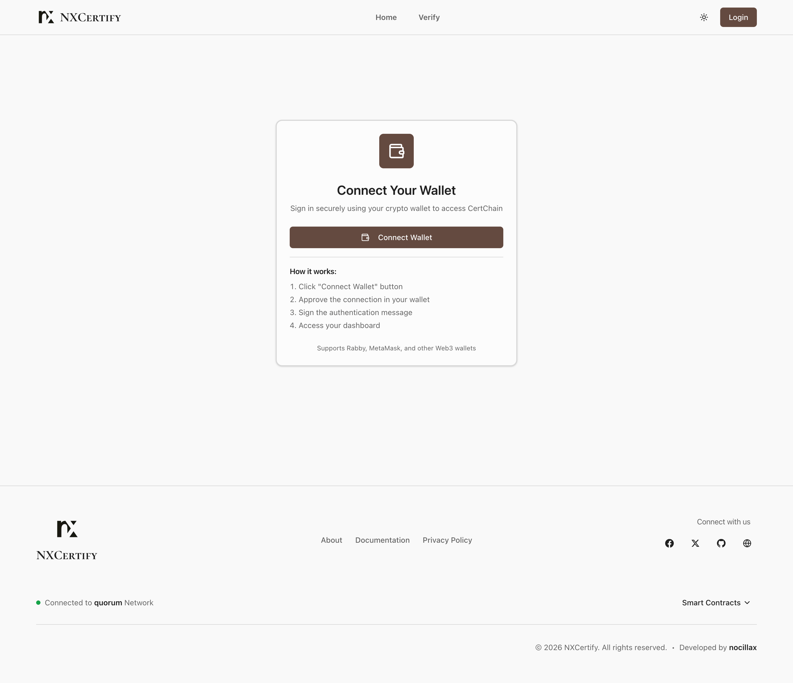
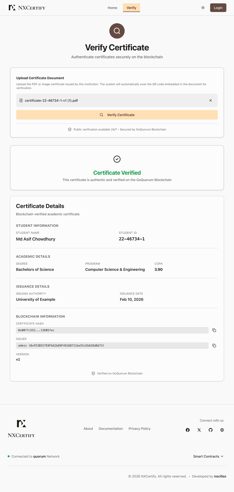
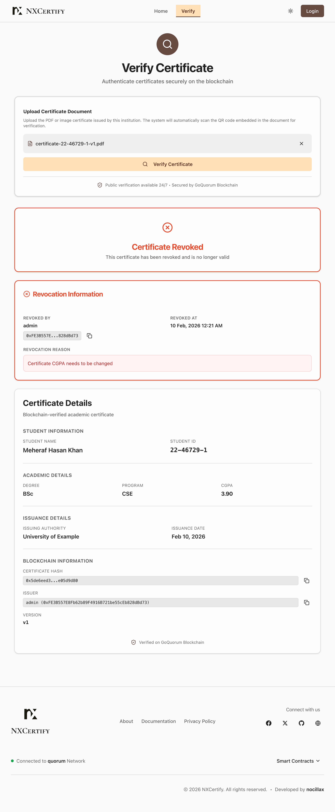
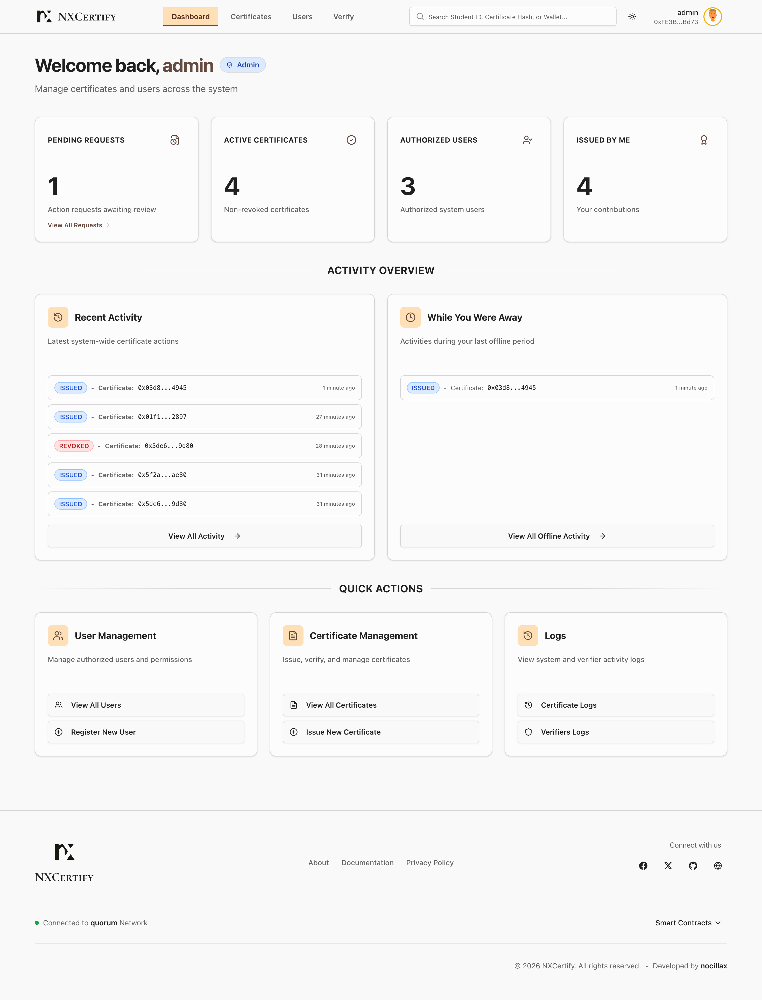
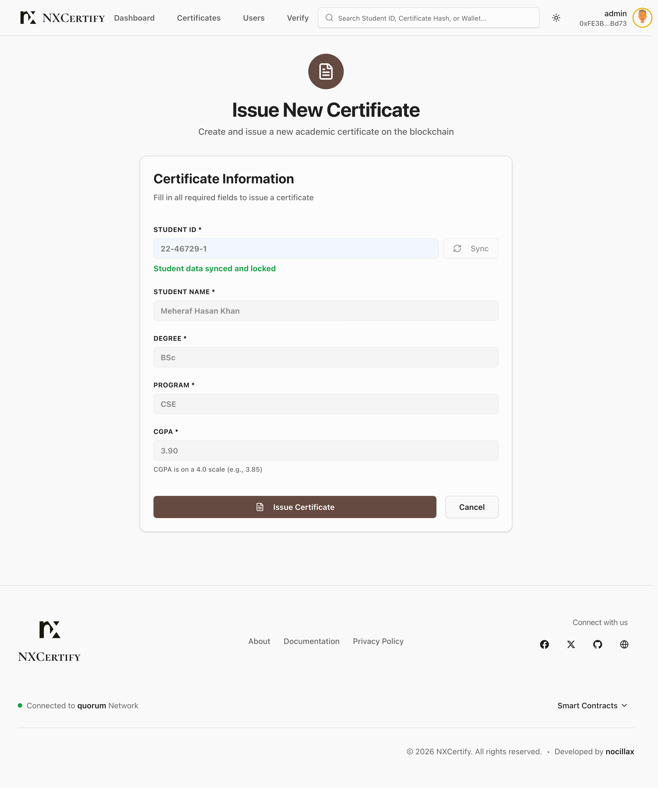
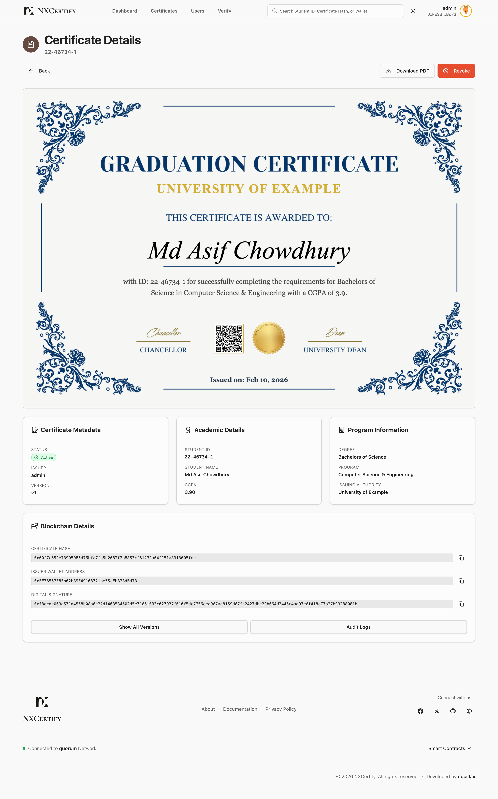
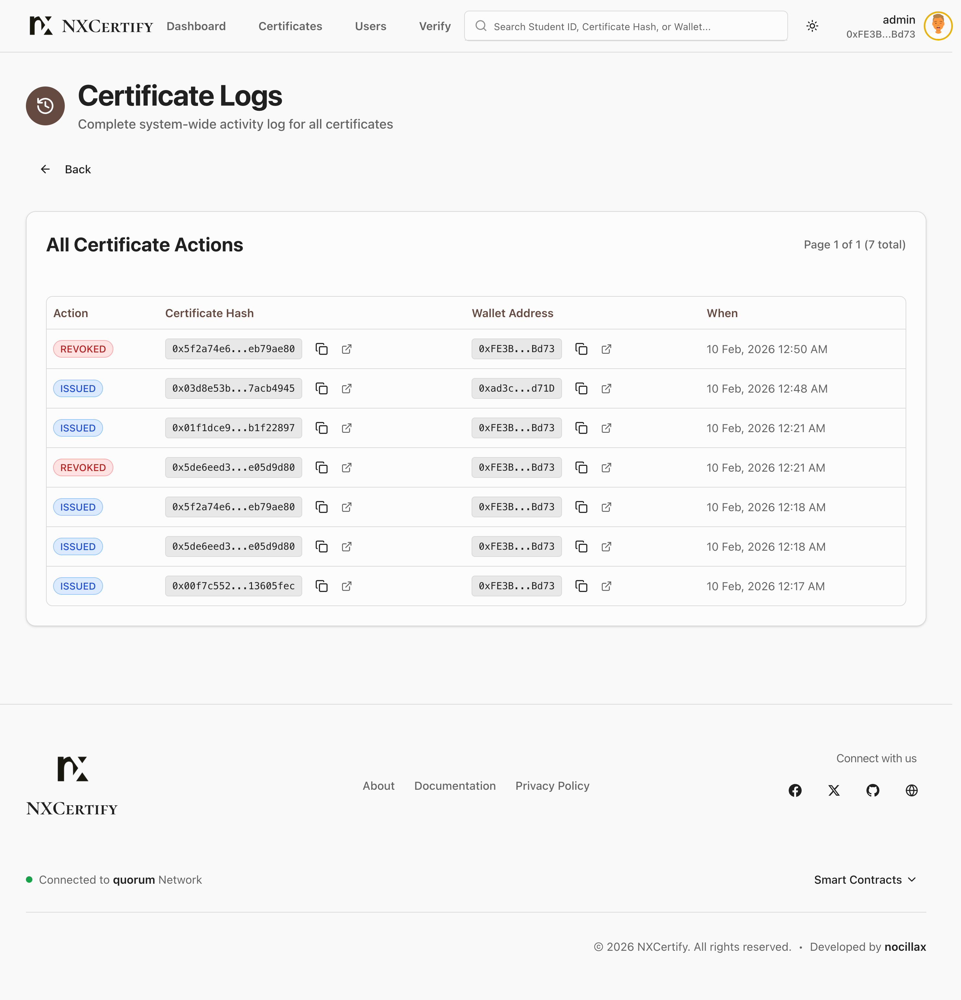
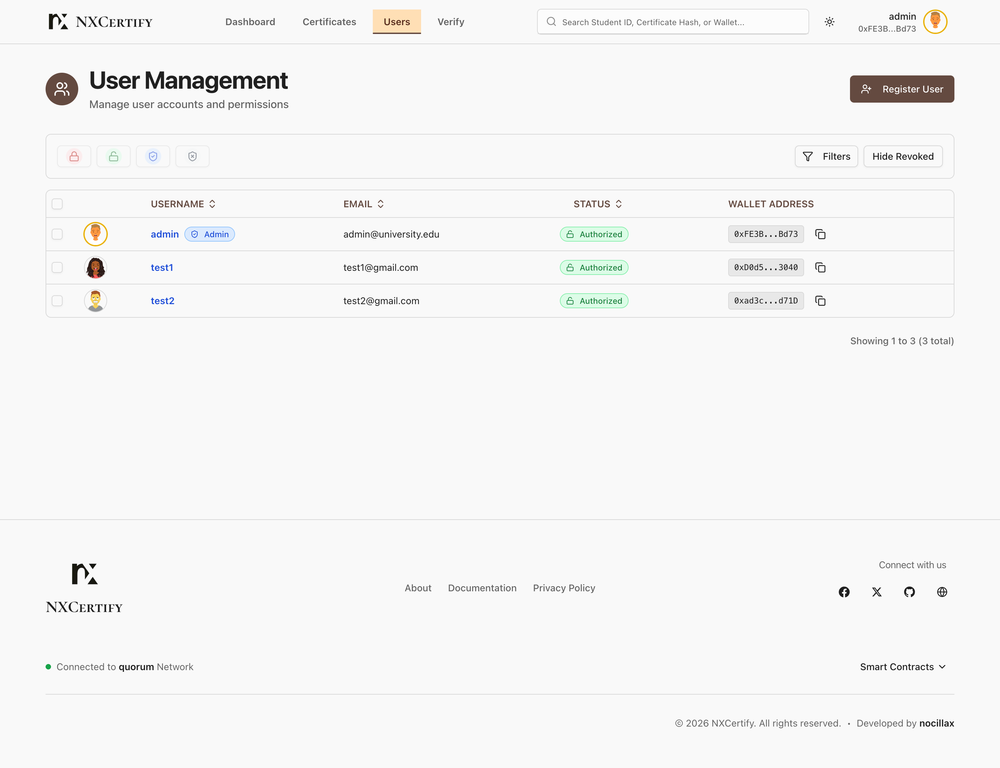

# NXCertify

NXCertify is a project for issuing and verifying academic certificates on a local Ethereum (GoQuorum) network using wallet-based authentication.

## What this repository contains

- `blockchain/`: smart contracts and deployment scripts
- `backend/`: NestJS server
- `frontend/`: Next.js application
- `quorum-test-network/`: local GoQuorum network

## Prerequisites

Install these before starting:

- Git
- Node.js 18+ and npm
- Docker Desktop (with Docker Compose)
- Rabby Wallet browser extension

No global NestJS/Next.js installation is required (the project uses local package scripts).

## Installation and setup (single flow)

### 1. Clone repository

```bash
git clone https://github.com/<your-username>/<your-repo>.git
cd nxcertify
```

### 2. Install project dependencies

```bash
cd blockchain && npm install
cd ../backend && npm install
cd ../frontend && npm install
cd ..
```

### 3. Install GoQuorum network (first time only)

If `quorum-test-network/` is already in this repo, skip to Step 4.

```bash
npx quorum-dev-quickstart
```

When prompted, use:

- Client: `GoQuorum`
- Private transactions: press `Enter` (skip Tessera)
- Logging: press `Enter` (default)
- Chainlens monitoring: `N`
- Blockscout explorer: `N`
- Directory: press `Enter` (default `./quorum-test-network`)

### 4. Start GoQuorum

```bash
cd quorum-test-network
./run.sh
cd ..
```

Expected blockchain endpoint:

- RPC URL: `http://localhost:8545`
- Chain ID: `1337`

### 5. Deploy contracts and seed admin account

```bash
cd blockchain
npx hardhat run scripts/deploy-dev.js --network quorum
cd ..
```

From command output, copy these values:

- `USER_REGISTRY_ADDRESS`
- `CONTRACT_ADDRESS`
- `ADMIN_WALLET_ADDRESS`
- `PRIVATE_KEY`

### 6. Configure backend and start required Docker services

Create backend environment file:

```bash
cd backend
cp .env.example .env
```

Update `.env` with the values from Step 5 (especially the four keys above).

Start backend support services with Docker Compose:

```bash
docker compose up -d
```

Then start backend server:

```bash
npm run start:dev
```

Backend runs on:

- `http://localhost:3001`

### 7. Configure frontend

Open a new terminal:

```bash
cd frontend
cp .env.local.example .env.local
```

Set or verify these values in `.env.local`:

- `NEXT_PUBLIC_API_URL=http://localhost:3001`
- `NEXT_PUBLIC_BLOCKCHAIN_NETWORK=quorum`
- `NEXT_PUBLIC_USER_REGISTRY_ADDRESS=<from step 5>`
- `NEXT_PUBLIC_CONTRACT_ADDRESS=<from step 5>`
- `NEXT_PUBLIC_ADMIN_WALLET_ADDRESS=<from step 5>`

Run frontend:

```bash
npm run dev
```

Frontend runs on:

- `http://localhost:3000`

### 8. Rabby Wallet setup (required)

1. Install Rabby extension from Chrome Web Store.
2. Open Rabby and choose **I already have an address**.
3. Choose **Private Key**.
4. Paste `PRIVATE_KEY` from Step 5 (or from backend `.env`).
5. Complete wallet import.
6. Add custom network in Rabby:
   - Network Name: `Quorum Local`
   - RPC URL: `http://localhost:8545`
   - Chain ID: `1337`
   - Currency Symbol: `ETH`
7. Switch Rabby to this network and imported admin account.

### 9. Run the app

- Open `http://localhost:3000/login`
- Connect Rabby
- Sign the login message
- You should be able to access the dashboard and test certificate flows

## Quick troubleshooting

- Blockchain not reachable: restart network from `quorum-test-network/` using `./stop.sh` then `./run.sh`
- Login/signature issues: confirm Rabby is on Chain ID `1337` and using the imported admin account
- Frontend cannot call backend: confirm backend is running on port `3001` and `NEXT_PUBLIC_API_URL` is `http://localhost:3001`

## Screenshots

### Public flow

**Login** - Wallet connection page for secure sign-in.



**Verify certificate (valid)** - Public verification result for a valid certificate.



**Verify certificate (revoked/invalid)** - Verification result when a certificate is revoked.



### Admin flow

**Admin dashboard** - System overview with quick actions and activity summaries.



**Issue certificate** - Form used to create and issue a new certificate.



**Certificate details** - Full certificate view with metadata and blockchain data.



**Certificate logs** - System-wide certificate activity history.



**User management** - Admin panel for authorized users and account control.


